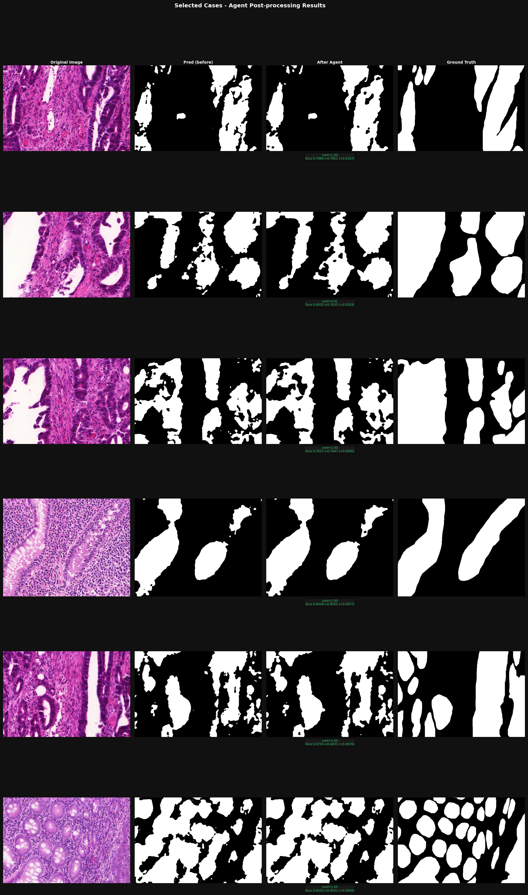

# Agentic Pathology Post-Processing

> An intelligent, rule-based agent that automatically detects and corrects common errors in histopathology segmentation masks — without an LLM, without retraining, and without making things worse.

## Example Output



*Agent corrects fragmented, holey, and noisy predictions using hybrid global + region reasoning — with automatic rollback if a change makes things worse.*

---

## Overview

Segmentation models for medical imaging are good — but not perfect. They regularly produce masks with noise, holes, merged objects, or broken fragments. Fixing these issues manually is time-consuming and inconsistent.

This project builds an **agentic post-processing pipeline** that:

1. Analyses the predicted mask using pathology-aware features
2. Classifies what's wrong (noisy? holey? fragmented?)
3. Selects and applies the right correction tool
4. Validates the result — and rolls back if it made things worse

No LLM. No retraining. Pure reasoning over signal.

---

## The Problem

Segmentation models in computational pathology fail in predictable ways:

| Failure mode | What it looks like |
|---|---|
| **Noisy** | Scattered small blobs around real glands |
| **Holey** | Internal holes in the gland body |
| **Merged** | Two separate glands fused together |
| **Fragmented** | Main gland broken into disconnected pieces |
| **Rough boundary** | Jagged, spiky gland outlines |
| **Under-segmented** | Gland boundaries drawn too tight |

Each of these requires a different fix. Applying the wrong one can make the mask *worse* — so blind post-processing doesn't work.

---

## Approach

The agent extracts a **feature vector** from each mask (object count, compactness, hole size, boundary roughness, nearby fragment ratio, etc.) and uses a **deterministic scoring system** to decide what's wrong and what to do about it.

```
Prediction Mask
      │
      ▼
 Feature Extraction  ──►  boundary_roughness, holes_count,
                           small_object_ratio, compactness,
                           nearby_fragment_ratio, ...
      │
      ▼
 Reasoning Agent  ──►  classify issue → score tools → select action
      │
      ▼
 Post-processing Tool  ──►  applied with adaptive parameters
      │
      ▼
 Step Validation  ──►  proxy signals checked (area, compactness, Dice)
      │
      ├── accepted → keep result
      └── rejected → rollback to previous mask
```

**No harmful actions are ever committed.** Every step is validated before the result is finalized.

---

## Pipeline Architecture

The system runs a **hybrid two-pipeline architecture**:

### Global Pipeline
Processes the whole mask at once. Best for:
- Removing scattered noise (`remove_small_objects`)
- Closing widespread holes (`morph_close`)
- Reconnecting fragmented glands (`connect_fragments`)

### Region Pipeline
Processes each connected component individually. Best for:
- Per-gland hole filling (`fill_holes`)
- Splitting merged glands (`watershed_split`)
- Smoothing rough boundaries (`morph_open`)

### Hybrid Orchestrator
Routes each mask to the right pipeline — or runs both and picks the better result.

```
Routing logic:
  noisy mask             → global pipeline
  holey (widespread)     → global pipeline
  mixed per-gland issues → region pipeline
  ambiguous              → run both, compare, pick best
```

Acceptance uses a **three-tier decision**:
1. **Hard veto** — reject if area collapses or objects disappear catastrophically
2. **Dice-first** — accept immediately if GT Dice improves ≥ 0.002
3. **Score-gate** — accept if proxy score stays within 4% of baseline

---

## Key Features

- **Deterministic agent** — no LLM, no black box. Every decision is traceable to a feature value and a scoring rule.
- **Pathology-aware features** — boundary roughness, lumen detection, fragment proximity, compactness — tailored for gland morphology.
- **Adaptive parameters** — kernel sizes, hole thresholds, and gap distances are computed from the mask, not hardcoded.
- **Risk-aware validation** — every tool application is validated. Regressions are rolled back automatically.
- **Two-tier region processing** — global issues (noise, fragments) handled once at mask level; local issues (holes, shape) handled per gland.
- **8 post-processing tools** — covering the full range of common segmentation failures.

### Tools available

| Tool | Fixes |
|---|---|
| `remove_small_objects` | Noise, debris blobs |
| `fill_holes` | Small internal holes |
| `morph_close` | Gaps, internal voids |
| `morph_open` | Spiky boundaries, thin protrusions |
| `erosion` | Thin bridges between merged objects |
| `dilation` | Under-segmented, too-tight boundaries |
| `watershed_split` | Merged/touching glands |
| `connect_fragments` | Broken gland continuity |

---

## Results

Evaluated on 80 samples (two test sets) using the hybrid pipeline.

| Metric | Value |
|---|---|
| Improved (Dice Δ > +0.002) | **40%** of samples |
| Max single-sample gain | **+0.0167 Dice** |
| Regressions | **< 2%** of samples |
| Rollbacks triggered | automatic — zero harmful commits |

Agent correctly routes fragmented masks to `connect_fragments`, holey masks to `morph_close` / `fill_holes`, and rolls back any action that fails the proxy validation check.

---

## Example Cases

### Case 1 — Noisy mask

The model produced a correct gland shape but scattered 30+ small blobs across the image.

- **Feature signal:** `small_object_ratio = 0.82`, `avg_object_size` low
- **Agent decision:** `noisy` → `remove_small_objects`
- **Result:** debris removed, main gland preserved, Dice +0.014

### Case 2 — Holey mask

A large gland with 3 internal holes from staining artifacts.

- **Feature signal:** `holes_count = 3`, `avg_hole_size = 625px`
- **Agent decision:** `holey` → `fill_holes` (max_hole_size adaptive to gland area)
- **Result:** holes filled without touching the outer boundary, Dice +0.029

### Case 3 — Fragmented gland

Main gland body with two small disconnected satellite pieces (~320px each, gap < 15px).

- **Feature signal:** `nearby_fragment_ratio = 0.83`, `small_object_ratio = 0.28`
- **Agent decision:** `fragmented` → `connect_fragments`
- **Result:** bridge built between fragments and main body using distance transform, object count 3 → 1

---

## Why This Matters

Most post-processing in medical imaging is either:
- **Nothing** — deploy the model and accept its errors
- **Hard-coded** — apply the same morphological operation to everything

This project does something different: it **reasons about what's wrong** before acting, applies corrections **proportionate to the problem**, and **guarantees it won't make things worse**.

That makes it practical to use in real pipelines — especially when ground truth isn't always available at inference time.

---

## How to Run

### Install dependencies

```bash
pip install -r requirements.txt
```

### Run the demo

```bash
python main.py
```

Runs 4 synthetic cases (clean, noisy, holey, merged) through the hybrid pipeline and prints a summary table. Saves visualization to `outputs/visualizations/pipeline_demo.png`.

### Run tool tests

```bash
python tests/test_tools.py
```

Tests all 8 post-processing tools on synthetic masks and saves a before/after visualization.

### Evaluate on a dataset

```bash
python scripts/evaluate_samples.py
```

Expects `data/samples/{image,mask,pred}/`. Outputs CSV report and visualization PNGs to `outputs/`.

---

## Project Structure

```
.
├── main.py                        # Demo entry point
├── requirements.txt
│
├── src/
│   ├── pipeline.py                # Global pipeline
│   ├── region_pipeline.py         # Two-tier region-aware pipeline
│   ├── hybrid_pipeline.py         # Hybrid orchestrator
│   ├── agent/
│   │   ├── reasoning.py           # PathologyReasoningAgent
│   │   └── region_features.py     # Per-component feature extraction
│   ├── features/
│   │   └── extractor.py           # Global feature extraction
│   ├── tools/
│   │   └── postprocessing.py      # All 8 post-processing tools
│   └── evaluation/
│       └── metrics.py             # Dice / IoU
│
├── tests/
│   ├── test_tools.py
│   ├── test_agent.py
│   ├── test_features.py
│   ├── test_region_pipeline.py
│   └── test_hybrid_pipeline.py
│
├── scripts/
│   ├── evaluate_samples.py        # Batch evaluation on any dataset
│   └── evaluate_glas.py           # GlaS-format evaluation
│
└── outputs/
    └── visualizations/            # Combined + per-case result images
```

---

## Future Work

- **Confidence calibration** — learn per-issue confidence thresholds from labelled data
- **Instance-aware features** — use instance segmentation masks (not just binary) for richer per-gland reasoning
- **Learned tool scoring** — replace hand-crafted scoring rules with a small trained model
- **Broader dataset evaluation** — test on full GlaS, CRAG, and DigestPath benchmarks
- **Real-time inference mode** — optimise for tiled WSI processing at scale

---

## Dependencies

```
numpy         2.2.6
scipy         1.17.1
scikit-image  0.26.0
opencv-python 4.12.0.88
matplotlib    3.10.8
pandas        2.3.0
```

Python 3.10+
